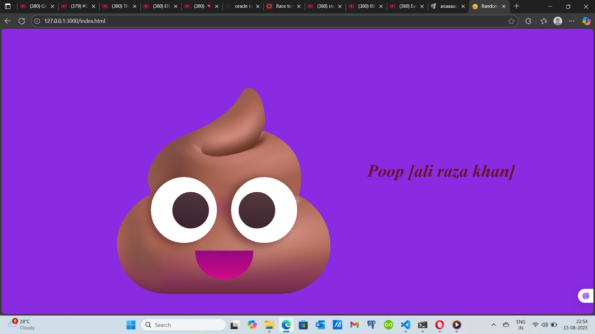

# 😁 Random Emojies Generator

A fun, lightweight JavaScript project that generates a random emoji on hover,  
along with a unique, quirky text description for each emoji.  
Perfect for beginners learning DOM manipulation and event handling.

---

## 📸 Screenshot

---

## 🧐 Features
- 🎲 **Random Emoji on Hover** — every time you hover, you get a surprise!
- 📝 **Unique Description** for each emoji.
- ⚡ **Fast & Lightweight** — no libraries, pure JavaScript.
- 🎨 **Smooth Animations** for a cooler look.

---

## 🛠️ Tech Stack
- **HTML5** — Structure
- **CSS3** — Styling & Animations
- **JavaScript (ES6)** — Logic

---

## 📂 Project Structure
